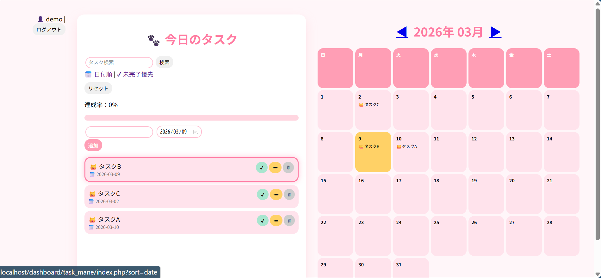

# 🐾 にゃんタスク管理アプリ

PHPとMySQLを使用して開発したタスク管理アプリです。
「今日のタスク」にフォーカスし、未完了タスクを上部に表示することで
**その日にやるべきタスクが一目で分かる設計**にしました。

---

## 🔑 デモアカウント

| 項目       | 内容      |
| -------- | ------- |
| username | demo    |
| password | demo123 |

---

## 📌 主な機能

* ユーザー登録 / ログイン / ログアウト
* タスク追加 / 編集 / 削除
* タスク完了切り替え
* 今日のタスクを上部固定表示
* 未完了タスクを優先表示
* 今日のタスク達成率を自動計算
* 月単位カレンダー表示
* タスク検索機能
* CSRF対策
* PDOを使用した安全なデータベース接続

---

## 🛠 使用技術

| 技術         | 用途       |
| ---------- | -------- |
| PHP        | バックエンド処理 |
| MySQL      | データベース   |
| PDO        | DB接続     |
| HTML / CSS | UI       |
| XAMPP      | ローカル開発環境 |

---

## 💡 工夫した点

* 今日の日付のみ抽出して優先表示するロジックを実装
* 未完了タスクを上部に表示するため **ORDER BY** を活用
* 今日のタスクのみを対象に達成率を動的計算
* 視認性を意識した柔らかいUIデザイン

---

## 🗄 データベース設計

### users テーブル

| カラム        | 型        | 説明         |
| ---------- | -------- | ---------- |
| id         | int      | ユーザーID     |
| username   | varchar  | ユーザー名      |
| password   | varchar  | ハッシュ化パスワード |
| created_at | datetime | 作成日時       |

---

### tasks テーブル

| カラム        | 型        | 説明     |
| ---------- | -------- | ------ |
| id         | int      | タスクID  |
| user_id    | int      | ユーザーID |
| task       | varchar  | タスク内容  |
| task_date  | date     | 実行日    |
| is_done    | boolean  | 完了フラグ  |
| created_at | datetime | 作成日時   |

---

## 🖥 画面イメージ

---

## 🚀 今後の改善予定

* レスポンシブ対応（スマートフォン表示）
* アプリ公開（デプロイ）
* タスクの並び替え機能
* UIの改善
